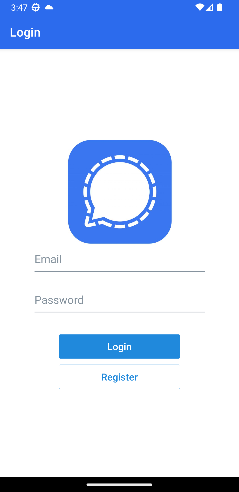
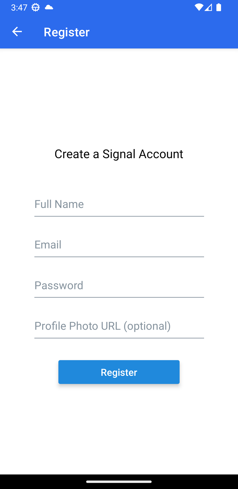
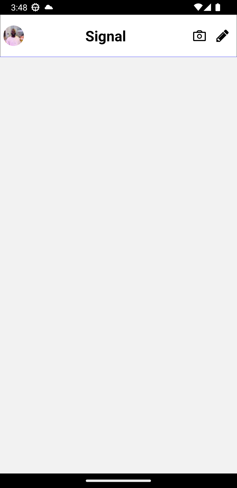
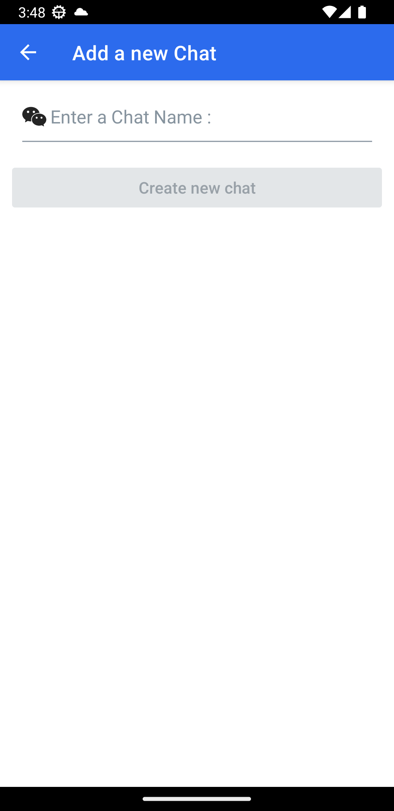

# Signal-clone
# My React Native App

This mobile application is built with React Native and Javascript. It uses libraries such as firebase and Expo. The app features a login screen, a registeration screen, a Home screen and a Chat Screen .It uses Frebase authentication and fire-store for storing data.

## Technologies
- [NativeWind](https://nativewind.dev): NativeWind uses Tailwind CSS as scripting language to create a universal style system for React Native.
- [Firebase](https://firebase.google.com/): An app development Platform. 
- [Expo](https://expo.io/): An open-source platform for making universal native apps for Android, iOS, and the web with JavaScript and React.

## Installation

First, clone the repository:

git clone https://github.com/0xNunana/Signal-clone.git

Then, install the dependencies:
cd Signal-clone
npm install

To start the Expo server, run:
expo start

Register your app on Firebase to get the necessary keys.

## Images
      
